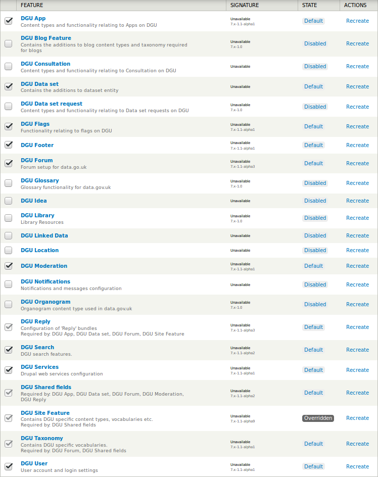

# Avaandmete portaali https://opendata.riik.ee kakskeelse kasutajaliidese loomine ja tõlgete ning tõlkemoodulite seadistamine

Projekti eesmärgiks oli muuta http://opendata.riik.ee kasutajaliides ligipääsetavaks ka inglise keeles. Sisuliselt tähendab see kakskeelse kasutajaliidese loomist ning seadistamist. Kuna kõik poraali aluseks olnud tarkvaramoodulid toetavad vähemalt teatud määral tõlkemoodulite kasutamist, siis töö suurimaks osaks oli tõlkemoodulite seadistamine ja nende omavahelisse kooskõlla viimine.

Kuna portaali kasutajalides oli loodud osaliselt eestikeelsena, osaliselt tõlgitud eesti keelde ingliskeelses lähtekoodis vajalikes kohtades võõrkeelsete fraaside _ad hoc_ asendamisega vastavate eestikeelsete fraasidega, siis oli tõlkemoodulite seadistamise eelduseks lähtekoodis kirjeldatud eesti fraaside eemaldamine, asendamine ingliskeelsete fraasidega ning eemaldatud eestikeelsete fraaside säilitamine taaskasutuseks tõlkemoodulites.

Järgnev kirjeldab tõlkemoodulite ja taaskasutamiseks ettevalmistatud ning täiendavalt loodud tõlkefailide seadistamise protsessi juba töös olevas avaandmete portaalis https://opendata.riik.ee ning pakub sinna kõrvale elementaarseid selgitusi portaali tõlkeprotsessi tehnilise ja sisulise korralduse mõistmiseks.

Portaali eri komponentide tõlkemoodulite omavahelist ühildamist, lähtekoodi tõlkimiseks ettevalmistamist jm tehtud töid, sh tõlkesüsteemi üldist ülesehitust ja sellega seotud küsimusi lahatakse täpsemalt tõlkesüsteemi kirjelduses, mis on jälgitavuse huvides vormistatud [eraldi dokumendina](docs/README.md).

## Juhendi kontekst ja terminite kasutus

Juhend on kirjutatud lähtuvalt eeldusest, et selle kasutaja on tuttav [avaandmete portaali paigaldusjuhendiga](https://github.com/opendata-ee/dgu-vagrant-puppet/blob/togo/Avaandmete%20portaali%20paigaldusjuhend.odt) (ja varundamis- ning taasteplaaniga), ka on püütud järgida selle malli terminikasutuses ja juhiste esituses.

## Süsteemi varukoopia tegemine

Süsteemi taastamise võimalike vigade korral tagab piisava kindlusega eeldatavasti järgmine skript, mis varundab nii lähtekoodi kui andmebaasid ning lisaks ka CKAN keskkonna seisu ning otsingu/indekseerimise keskkonna seadistused:

	cp -a /vagrant/src .
	cp -a /var/www/drupal .
	cp -a /var/ckan var_ckan
	cp -a /var/lib/ckan var_lib_ckan
	cp -a /etc/apache2 .
	cp -a /usr/share/solr .
	cp -a /home/co .
	cp /etc/apache2/sites-available/ckan.conf .
	cp /var/ckan/ckan.ini .
	sudo -iu postgres pg_dump ckan > ckan.sql
	mysqldump -p -u co dgu > dgu.sql

MySQL varundamise käsk küsib parooli, milleks on `pass`.

## CKAN keskkonnale lülitumine

Oluline on lülituda CKAN keskkonnale, et uuendataks ainult õigeid faile ja täpselt õigel viisil ning selleks tuleb käivitada käsk:

	$ su co

Seda CKAN keskkonnale lülitumist tasub endale iga kord meelde tuletada, kui on vaja süsteemis mingeid uuendusi teha või logid masinasse sisse.

Ka on mõistlik lähtekoodi ja saidi seadistuste muutmise ajaks peatada veebiserver ja panna sait hooldusrežiimile. Viimast saab teha Drupali saidi admin-veebis aadressil [/admin/config/development/maintenance](https://opendata.riik.ee/et/admin/config/development/maintenance).

Uuenduste rakendamiseks veebiserveris võib puhastada vahemälud ja serveri taaskäivitada:

	$ drush cc all && sudo service apache2 restart
	
## Apache'i veebiserveri seadistused

Faili `/etc/apache2/sites-available/ckan.conf` tuleb lisada CKANi veebile vahendava WSGI skripti jaoks täiendavalt teenindatavad kataloogid kummagi keele jaoks, mida kavatsetakse toetada:

	  # English
	  WSGIScriptAlias /en/inventory/ /var/ckan/wsgi_app.py/
	  WSGIScriptAlias /en/unpublished/ /var/ckan/wsgi_app.py/
	  WSGIScriptAlias /en/data /var/ckan/wsgi_app.py
	  WSGIScriptAlias /en/dataset /var/ckan/wsgi_app.py
	  WSGIScriptAlias /en/publisher /var/ckan/wsgi_app.py
	  WSGIScriptAlias /en/css /var/ckan/wsgi_app.py
	  WSGIScriptAlias /en/images /var/ckan/wsgi_app.py
	  WSGIScriptAlias /en/scripts /var/ckan/wsgi_app.py
	  WSGIScriptAlias /en/api /var/ckan/wsgi_app.py
	  WSGIScriptAlias /en/geoserver /var/ckan/wsgi_app.py
	  WSGIScriptAlias /en/harvest /var/ckan/wsgi_app.py
	  WSGIScriptAlias /en/ckanext /var/ckan/wsgi_app.py
	  WSGIScriptAlias /en/ckan-admin /var/ckan/wsgi_app.py
	  WSGIScriptAlias /en/qa /var/ckan/wsgi_app.py
	  WSGIScriptAlias /en/revision /var/ckan/wsgi_app.py
	  WSGIScriptAlias /en/feeds /var/ckan/wsgi_app.py
	  WSGIScriptAlias /en/img /var/ckan/wsgi_app.py
	  WSGIScriptAlias /en/csw /var/ckan/wsgi_app.py
	  WSGIScriptAlias /en/font /var/ckan/wsgi_app.py
	  WSGIScriptAlias /en/organization /var/ckan/wsgi_app.py
	  WSGIScriptAlias /en/linked-data-admin /var/ckan/wsgi_app.py
	
	  # Estonian
	  WSGIScriptAlias /et/inventory/ /var/ckan/wsgi_app.py/
	  WSGIScriptAlias /et/unpublished/ /var/ckan/wsgi_app.py/
	  WSGIScriptAlias /et/data /var/ckan/wsgi_app.py
	  WSGIScriptAlias /et/dataset /var/ckan/wsgi_app.py
	  WSGIScriptAlias /et/publisher /var/ckan/wsgi_app.py
	  WSGIScriptAlias /et/css /var/ckan/wsgi_app.py
	  WSGIScriptAlias /et/images /var/ckan/wsgi_app.py
	  WSGIScriptAlias /et/scripts /var/ckan/wsgi_app.py
	  WSGIScriptAlias /et/api /var/ckan/wsgi_app.py
	  WSGIScriptAlias /et/geoserver /var/ckan/wsgi_app.py
	  WSGIScriptAlias /et/harvest /var/ckan/wsgi_app.py
	  WSGIScriptAlias /et/ckanext /var/ckan/wsgi_app.py
	  WSGIScriptAlias /et/ckan-admin /var/ckan/wsgi_app.py
	  WSGIScriptAlias /et/qa /var/ckan/wsgi_app.py
	  WSGIScriptAlias /et/revision /var/ckan/wsgi_app.py
	  WSGIScriptAlias /et/feeds /var/ckan/wsgi_app.py
	  WSGIScriptAlias /et/img /var/ckan/wsgi_app.py
	  WSGIScriptAlias /et/csw /var/ckan/wsgi_app.py
	  WSGIScriptAlias /et/font /var/ckan/wsgi_app.py
	  WSGIScriptAlias /et/organization /var/ckan/wsgi_app.py
	  WSGIScriptAlias /et/linked-data-admin /var/ckan/wsgi_app.py
	
Tõenäoliselt pole neid kõiki vaja, sj ei kasutata Eesti avaandmete portaalis suurt osa neist CKANi moodulitest, aga need on moodustatud eelneva keeleneutraalse sektsiooni põhjal. Kui siit midagi eemaldama hakata, siis peaks eemaldama ka keeleneutraalsete kataloogide seast.

Kui juba Apache seadistusfail lahti on, siis võiks parandada "Server not found" vigade vältimiseks ära ka [suunamise turvalisele HTTP kanalile](http://httpd.apache.org/docs/current/rewrite/avoid.html#redirect) ja lisada veebisaidi aadressi lõppu puuduva kaldkriipsu:

	<VirtualHost *:80>
		Redirect permanent / https://opendata.riik.ee/
	</VirtualHost>

## CKANi seadistused

Faili `/var/ckan/ckan.ini` tuleb lisada mitmekeelsust toetavad seadistused.

Esiteks mitmekeelse Eurovoc sõnastiku jaoks `multilingual_tag` pluginate nimekirja lõppu juurde:

	ckan.plugins = dgu_publisher_form dgu_publishers dgu_auth_api dgu_form dgu_theme cswserver harvest ckan_harvester gemini_csw_harvester gemini_doc_harvester gemini_waf_harvester spatial_harvest_metadata_api spatial_query qa synchronous_search dgu_search dgu_dataset_form spatial_metadata os_search os_preview archiver dgu_api ga-report datapreview dgu_inventory hierarchy_display report dgu_report dgu_drupal_auth multilingual_tag

Seejärel määrata saidi URLi lõppu keeleindikaator `{{LANG}}`, mis hakkab märku andma, mis keeles peab CKAN kasutajaga suhtlema:

	ckan.site_url = http://localhost:80/{{LANG}}

Seejärel lubatud keelte hulgas märkida ära eesti keel vaikimisi keelena ja inglise keel teise keelena:

	ckan.locale_default = et
	ckan.locales_offered = et en
	ckan.locale_order = et en

Nende muudatuste järel võib proovida, kas kõik vajalik töötab veel endiselt, sest nende rakendumise järel ei peaks saidil silmnähtavaid muutusi toimuma, küll aga peaks olema seadistatud CKANi mitmekeelse kasutajaliidese jaoks vajalik taustsüsteem.

## Lähtekoodi uuendamine

Kui mitmekeelsuse jaoks vajalikud muudatused avaandmete portaali lähtekoodis on liidetud ametlikesse koodivaramutesse aadressil https://github.com/opendata-ee/, siis peaks piisama lähtekoodi uuendamiseks kõigi kataloogis `/src` ja `/var/www/drupal/dgu/profiles/dgu` olevate versioonihalduse seisude uuendamisest (igas alamkataloogis `git pull`) ja seejärel täiendavate käskude andmisest (vt täpsemalt altpoolt), mis genereerivad uuesti elik värskendavad vajalikud keele-, skripti- ja laadifailid, aga esialgu on vaja määrata lähtekoodi uuendamiseks alternatiivsed versioonihalduse allikad.

Keelemoodulite liidestamise lähtekood koos sinna tehtud jooksvate muudatustega on GitHubi keskkonnas arendaja konto all olevates varamutes, mille leiab aadressilt https://github.com/infoaed ning mis väljendab muudatuste loetelu, mida oli vaja teha mitmekeelsuse võimaldamisks avaandmete portaali käitamisel kasutusel olevasse lähtekoodi.

Käsuga `git remote -v` näidatakse, missugune lähtekoodi varamu on vastavas kataloogis kasutusel, nt `ckan` kataloogis annab käsk tulemuseks:

	origin	https://github.com/opendata-ee/ckan.git (fetch)
	origin	https://github.com/opendata-ee/ckan.git (push)

Varamu muutmiseks sobib käsk `git remote set-url origin https://github.com/infoaed/ckan.git` ja selle tulemusel valitakse lähtekoodi varamuks mitmekeelsuse arenduse oma. Sama käsku muudetud varamu aadressiga (`infoaed` `opendata-ee` asemel) nimega tuleks käivitada kõigis https://github.com/infoaed peale kopeeritud avaandmete portaali varamutes, st lisaks `ckan` varamule ka `dgu_d7`, `ckanext-dgu`, `ckanext-spatial`, `ckanext-harvest`, `ckanext-ga-report` ja `shared_dguk_assets` varamutes.

Lisaks neile tuleb lülituda mitmekeelsuse muudatuste lähtekoodivaramule ka Drupali poolt aktiivselt kasutatavas `/var/www/drupal/dgu/profiles/dgu` kataloogis, kus paikneb koopia süsteemi Drupali harust, mis peaks olema identne haruga `dgu_d7`.

Igas kataloogis võiks ka kontrollida, kas on tehtud lähtekoodi _ad hoc_ muudatusi, mis koodivaramutes ei kajastu. Selleks sobvad käsud `git status` ja `git diff`, neist esimene muudatuste olemasolu tuvastamiseks ja teine nende täpsemaks uurimiseks ja/või talletamiseks.

Antud juhul ilmnesid erinevused `ckan` ja Drupali aktiivses `dgu_d7` harus `/var/www/drupal/dgu/profiles/dgu` all, kuid kumbki neist ei ole takistuseks mitmekeelsuse täienduste kasutuselevõtmisel. Esimene neist puudutab _ad hoc_ tõlget ja selle võib talletada ning kõrvale jätta:

	index dfda547..9663d8a 100644
	--- a/ckan/controllers/package.py
	+++ b/ckan/controllers/package.py
	@@ -506,7 +506,7 @@ class PackageController(base.BaseController):
		 try:
		     check_access('package_create', context)
		 except NotAuthorized:
	-            abort(401, _('Unauthorized to create a package'))
	+            abort(401, _('Kasutaja tuvastamata!'))
	 
		 if context['save'] and not data:
		     return self._save_new(context, package_type=package_type)

Teine puudutab Google'i analüütikateenust ja ei tohiks puutuda uuendustesse:

	index 4f7a261..3e9be7a 100644
	--- a/themes/custom/dguk/templates/html.tpl.php
	+++ b/themes/custom/dguk/templates/html.tpl.php
	@@ -17,6 +17,7 @@
	     
	     
	     <?php print $scripts; ?>
	+    
	     <!-- HTML5 element support for IE6-8 -->
	     <!--[if lt IE 9]>
	     

Kui suuri muudatusi pole või on need talletatud edaspidiseks kasutamiseks, siis võib püüda lähtekoodi uuendada käivitades igas nimetatud koodivaramu kataloogis käsu `git pull`. Selle tulemusel peaks saama lähtekood uuendatud.

Uuenduste rakendumiseks töötavas süsteemis tuleb enamasti taaskäivitada veebiserver, ka on mõistlik enne uuendamist, sj lähtekoodi uuendamist varamutest veebiserver peatada või lülitada CKAN/Drupal hooldusrežiimile ning uuenduste allalaadimise ja täiendavate seadistuste genereerimise järel uuesti käivitada.

## Skripti-, laadi- ja keeleseadistuste genereerimine

Genereerimist vajavad seadistused on harudes `ckan`, `ckanext-dgu` ja `shared_dguk_assets`, esimeses neist on CKANi ja selle laiendusi puudutavad tõlked, teises skripti- ja laadifailid ning kolmandas CKANi ja Drupali poolt ühiselt kasutatavad skripti- ning laadifailid ja JavaScripti kasutavate komponentide tõlked.

> Tõlgete genereerimiseks on kasutusel CKANi tõlkesüsteem, mis põhineb _Gettext_-standardil ning kasutab tõlkefraaside kogumiseks ning haldamiseks Babeli moodulit. Sama standard on kasutusel ka JavaScripti tõlkimisel, kuid tõlked teisendatakse kasutamiseks tavapärase Gettext MO-objektkoodi asemel JSON-vormingusse. Drupali tõlked on samuti Gettext formaadis, kuid neid hallatakse Drupali enda vahenditega ning vajadusel eksporditakse/imporditakse (sellest allpool täpsemalt).
> 
> CKANi tõlkefailide haldamine toimub kolme eri ülesande vahel liikudes, sj neid vajadusel korrates või omavahel kombineerides:
> 
> * Tõlkefraaside kogumine lähtekoodist;
> * Leitud tõlkefraaside liitmine olemasolevate tõlgetega;
> * Objektkoodi või JSON-vormingus tõlgete genereerimine.
> 
> Neile lisanduvad toetavad tegevused nagu lähtekoodis olevate tekstilõikude, fraaside ja sõnade viimine tõlgitavale kujule ning vastav markeerimine (et neid saaks "koguda") kogutud fraaside tõlkimine ja ülevaatamine (sj kasutades tõlkemälusid- või korpusi, õigekirjakontrolli jm abivahendeid) ning tõlgete adekvaatsuse kontrollimine reaalses kasutuskeskkonnas.

Tõlkefailide kogumiseks CKAN lähtekoodist tuleb käivitada vastav seadistusskript kas `ckan` harus või `shared_dguk_assets` harus:

	$ python setup.py extract_messages

Kumbki neist loob tõlkemalli, mis koosneb tõlgitavate fraaside loendist ja need on leitavad failides `/src/ckan/ckan/i18n/ckan.pot` ja `/src/shared_dguk_assets/i18n/ckan-js.pot`. Kõigi kasutusel olevate CKANi ja Drupali moodulite lähtekeeleks on inglise keel ning tõlgitavad fraasid on esitatud lähtekeeles.

Kogutud tõlkefraaside liitmiseks olemasoleva eesti tõlkega tuleb käivitada seadistusskript vastavas režiimis:

	$ python setup.py update_catalog --locale et

Kui eesti tõlget pole veel loodud (nagu oli seis enne mitmekeelsuse täienduste arendust), siis tuleb need enne luua käsuga `python setup.py init_catalog --locale et`.

Tõlkefraaside liitmise tulemusena uuenevad eesti tõlkefailid `/src/ckan/ckan/i18n/et/LC_MESSAGES/ckan.po` `/src/shared_dguk_assets/i18n/et/LC_MESSAGES/values.po`, st neist eemaldatakse aegunud tõlkefraasid, mida enam lähtekoodist ei leita, ning neisse lisatakse uued tõlkefraasid, mis on lähtekoodi tekkinud kas uue funktsionaalsuse tõttu või selle tõttu, et mõni seni tõlkimiseks märgistamata fraas on viidud tõlgitavale kujule.

> Töö PO-failidega on tarkvaratõlke põhiline osa, need failid on tõlkimise põhilise standardina kasutusel enamikus GNU/Linux opsüsteemidest ning nende töötlemiseks, toimetamiseks ja analüüsiks on saadaval mitmesugust tarkvara eri opsüsteemidele. Windowsi all on tuntuim [Poedit](https://poedit.net/) ja GNU/Linux opsüsteemides on levinuimad [Lokalize](https://www.kde.org/applications/development/lokalize), [Gtranslator](https://wiki.gnome.org/Apps/Gtranslator) ja [Virtaal](http://virtaal.translatehouse.org/), lisaks on veebipõhised tõlkekeskkonnad nagu [Transifex](https://www.transifex.com/), [Launchpad](https://translations.launchpad.net/) jmt. Transifex on kasutusel ka CKANi tõlkekeskonnana, kuid eesti tõlkeprotsessis seda esimeses faasis ei kasutatud.
> 
> Kui PO-failides on puuduvad tõlked lisatud, hägusad (ingl k _fuzzy_) vasted üle kontrollitud ja muud tööd tehtud (tavaliselt rändavad nad selleks tarbeks tõlkija kätte, kes annavad nad pärast oma tööd täiendatuna tagasi), siis tuleb need teha ka süsteemis kasutatavaks.

Täiendatud tõlgete tööle rakendamiseks süsteemis tuleb `ckan` harus käivitada käsk:

	$ python setup.py compile_catalog --locale et

Selle tulemusel luuakse masinale loetavad MO-objektkoodis fail `/src/ckan/ckan/i18n/et/LC_MESSAGES/ckan.mo`, mida kasutab avaandmete portaal fraaside esitamisel kasutajatele. Täiendatud tõlgete rakendamiseks `shared_dguk_assets` harus tuleb käivitada:

	$ grunt default

Selle tulemusel luuakse JSON-standardile vastavalt markeeritud tõlkeid sisaldav tekstifail `/src/shared_dguk_assets/assets/json/i18n/et.json`, mida kasutavad portaali JavaScriptil põhinevad komponendid fraaside esitamiseks kasutajale. Grunt kasutab JSON-failide genereerimisel _po2json_ moodulit, mis tuleb paigaldada käsuga `npm install grunt-po2json`.

Viimase käsuga (st `grunt default`) uuendatakse ka CKANi ja Drupali poolt kasutatavad skripti- ning laadifailid. Sama käsk uuendab skripti- ja laadifaile ka `ckanext-dgu` harus. Kõik nimetatud käsud tuleb käivitada vastavate harude juurkataloogis, st kataloogides `/src/ckan`, `/src/ckanext-dgu` ja `/src/shared_dguk_assets` ning need tuleb käivitada CKANi kasutuskeskkonnas kasutajana `co` (vt ka viidet juhendi alguses).

## CKANi Eurovoc-märksõnastiku ja tõlgete importimine

CKANi Eurovoc-märksõnastikku saab uuendada ja tõlkeid lisada ainult siis, kui CKAN server käib ja mitmekeelsust võimaldavad moodulid on aktiveeritud.

> Eurovoc sõnastik on realiseeritud CKAN keskkonna soovituslike märksõnade sõnastikuna (ingl k _tag vocabulary_, vt täpsemalt [CKANi dokumentatsioonist](http://docs.ckan.org/en/ckan-2.2.3/tag-vocabularies.html)). Märksõnastiku tõlkimise võimalus on süsteemi sisse ehitatud ning [võimaldatud vastavate laiendustega](http://docs.ckan.org/en/ckan-2.2.3/multilingual.html#setup-and-configuration). Rangelt võttes pole Eurovoc sõnastiku tõlkimisel tegu kasutajaliidese tõlkimisega, vaid see on osa andmekihist ning lisaks on võimalik lülitada sisse ka mitmekeelsust andmehulkade ja teabevaldajate talletamisel ning esitamisel.

Uuendatud sõnastikufailid on tõlkelahenduse GitHubi varamus [taksonoomiate/klassifikaatorite kataloogis](https://github.com/infoaed/opendata-portal/tree/master/translations/taxonomy) ning need põhinevad Eurovoc märksõnastiku 2016. aasta [väljalaskel 4.5](http://eurovoc.europa.eu/drupal/?q=et/node/1486&cl=et). Esmalt võiks CKAN märksõnastikku lisada uuendatud eestikeelse sõnastiku ning seejärel sellele vastavad tõlked. Sõnastikufail ja tõlgete fail on ette valmistatud sama malli alusel nagu varasem sõnastik, st sealt on eemaldatud märgid, mis on CKAN märksõnastikus keelatud (st sulud, komad, apostroofid, jutumärgid jmt, lubatud on vaid sidekriips, allkriips ja punkt), kuigi need on samas tõlgetes lubatud. Eemaldatud on ka kirjed märkega _under translation_ ja üks kirje, mis ületas märksõnadele lubatud pikkuse piiri (_Vabadusel, Turvalisusel ja Õigusel Rajaneva Ala Suuremahuliste IT-süsteemide Operatiivjuhtimise Euroopa Amet_), täpsermalt vt [faili muudatuste ajaloost](https://github.com/infoaed/opendata-portal/commit/1cf1f09912797987fd5cb2c0ed8d510d47634609).

Märksõnade faili [eurovoc-4.5-et.json](https://raw.githubusercontent.com/infoaed/opendata-portal/master/translations/taxonomy/eurovoc-4.5-et.json) alusel märksõnastiku uuendamiseks tuleb mõnes Internetti ühendatud arvutis käivitada käsk:

	$ curl -X POST 'https://opendata.riik.ee/api/action/vocabulary_update' -H 'Authorization: {API_KEY}' --data @eurovoc-4.5-et.json

Märksõnastiku tõlgete lisamiseks [eurovoc-4.5-et-en.json](https://raw.githubusercontent.com/infoaed/opendata-portal/master/translations/taxonomy/eurovoc-4.5-et-en.json) failist tuleb käivitada:

	$ curl -X POST 'https://opendata.riik.ee/api/action/term_translation_update_many' -H 'Authorization: {API_KEY}' --data @eurovoc-4.5-et-en.json

Võtme leiab Drupali admin-veebi kataloogis [/admin/config/system/ckan](https://opendata.riik.ee/admin/config/system/ckan) lehelt ning see tuleb pannan käsus {API_KEY} asemele (ilma looksulgudeta). Kui importimine ei õnnestu, siis tasub uurida [CKAN API dokumentatsiooni](http://docs.ckan.org/en/ckan-2.2.3/api.html#ckan.logic.action.update.term_translation_update_many) ja/või veenduda serveri töökorras nt laadides esmalt prooviks üles mõne lühema faili. Märksõnastiku uuendamise käsk peaks vastama teatega _success_ ning tagastama kõigi lisatud märksõnade väärtused, tõlgete uuendamise käsk peaks tagastama teate _success_ ja lisatud tõlgete arvu.

## Drupali moodulite seadistamine

Drupali mitmekeelsuse kasutamiseks tuleb paigadalda uusi tõlkemooduleid või nende jaoks vajalikke mooduleid, uuendada olemasolevaid mooduleid ning muuta olemasolevaid seadistusi. Kuna käigus olev Drupali süsteem hoiab osa oma infost andmebaasis ja osa lähtekoodis — ning ainult osa sellest on lihtsal viisil automaatselt uuendatav, siis eeldab Drupali mitmekeesuse töökorda seadmine mõningast käsitööd.

### Drupali _Feature_-moodulid

Üldiselt teevad suurema jao seadistamise tööst ära Drupali sisemist versioonihaldust realiseerivad [_Feature_-moodulid](https://www.drupal.org/project/features), kuid need ei hakka tööle vaikimisi, vaid vajavad eraldi sisselülitamist. Sõltuvalt laivsüsteemis tehtud muudatustest võib olla vaja _Feature_-mooduleid ka nendega ühildada, kuigi ideaalis võiks piisata järgnevast [_drush_-käsust](http://www.drush.org) kataloogis `/var/www/drupal/dgu`:

	drush fra

See käsk [püüab taastada](https://drushcommands.com/drush-8x/features/features-import-all/) Drupali saidil selle seisu, mis on kirjeldatud saidi lähtekoodis olevates _Feature_-moodulites ning tühistada laivsüsteemis tehtud muudatused, mis on salvestatud lähtekoodi asemel jooksvalt andmebaasis.

> Siiski on enamasti laivsüsteemis tehtud vajalikke muudatusi, mida oleks vaja säilitada või mis on koodis realiseeritud _Feature_-moodulitega vastuolus. Need vastuolud on 18.01.2017 seisuga küll lahendatud, aga tõenäoliselt see portaali uuenduste vm jooksvate muudatuste tõttu päriselt nii ei jää. Seega on reaalne muudatuste rakendamise protsess samm-sammuline ja võib vajada jooksvat korrigeerimist. Ka ei paigalda _Feature_-moodulid kõiki vajalikke sõltuvusi ja kuigi see on tehniliselt võimalik, siiski poleks see mõistlik, sest _Feature_'ide süsteem [pole mõteldud asendama täiemahulist paketihaldust](https://www.drupal.org/docs/7/modules/features/version-control-and-configuration-management), vaid on üks võimalik abivahend paljude seast Drupali saitide seadistuste/laienduste haldamiseks.

Laivsüsteemi tehtud muudatusi saab uurida [vastavate _drush_-käskudega](https://drushcommands.com/drush-8x/features/features-diff/) (kasutamiseks paigaldada [Diff-moodul](https://www.drupal.org/project/diff)) ja neid tuleks kindluse mõttes esmalt [eksportida eraldi moodulisse](https://drushcommands.com/drush-8x/features/features-export/) või [vastavasse koodiharusse](https://drushcommands.com/drush-8x/features/features-add/) ning seejärel võrdlevalt liita [olemasoleva koodipuu vastavate sektsioonidega](https://github.com/opendata-ee/dgu_d7/tree/look_feel_est/modules/features). Üheks põhjuseks on, et Eesti avaandmete portaal kasutab täiendavaid tõlkevõimalusi, mille nt _drush_'i _add_-käsk kohati automaatselt üle kirjutab ning sellega osa kasutajaliidese tõlkeid võib tühistada. Tõlgete halduse anomaaliate vähendamise ja jälgitavuse huvides võiks määrata admin-veebi keeleks inglise keele ja teha sama [_drush_'i keelega](https://www.drupal.org/node/874760#comment-6785806).

Protsessi võib soovi korral ohjata ka admin-veebis [_Features_-sektsioonis](https://opendata.riik.ee/admin/structure/features), kus saab muudatusi visuaalselt võrrelda ja seal on koodis tehtud muudatuste kehtestamise käsuks _Revert_ ja muudatusi eksporditakse uude _Feature_-moodulisse käsuga _Create_. Avaandmete portraalis on kasutusel ainult osa DGU moodulitest ning kasutusel olevad moodulid on muudetud seadistustega.

Ülaloleval pildil on moodulite laivis oleva ja koodis oleva seisu vastuolud lahendatud, ainult üks moodul on seisundis, kus andmebaasis olev kirjutab üle midagi koodis olevat (seisund `Overridden`, kooskõlaline on `Default`, kui muudatused on probleemsed, siis on seisund tavaliselt `Needs review` vmt). _Feature_-moodulite uuendus/paigaldus on õnnestunud, kui ühegi _Feature_-mooduli staatus pole vastuoluline või on vastuoluks põhjendatud vajadus. Kui vastuolude lahendamine ühelgi iseenesestmõistetaval viisil ei õnnestu, siis tasub uurida, kas probleemile on [mõni dokumenteeritud lahendus](https://www.drupal.org/docs/7/modules/features/troubleshooting-reasons-features-may-be-stuck-as-overridden).

Ilmselt on vaja protsessi käigus üle genereerida kasutajagruppide ligipääsuõigused saidi sisutüüpidele admin-veebis [/admin/reports/status/rebuild](https://opendatatest.riik.ee/admin/reports/status/rebuild), mitmekeelsuse muudatustega _Feature_-moodulid on genereeritud _Features_ versiooniga 7.x-2.10, seega võib olla mõistlike tulemuste tarvis vaja uuendada ka _Features_-moodulit ennast `drush up features`. Kui muu ei tööta, siis saab lõpuks muuta panna seadistused koodiga klappima, muutes vajalikud moodulite seadistused ära käsitsi. Mõnikord piisab värskendamiseks ka seadistuste muutmisest, salvestamisest ja seejärel `drush fr {MOODUL}` käivitamisest.

Järgnevad _Feature_-moodulite lühikirjeldused mitmekeelsuse vaatepunktist. Osades moodulites mitmekeelsusega suuri muudatusi ei kaasne, neis kinnitatakse siis üle ainult mitmekeelse keskkonnaga kaasnevad vaikimisi seadistused, ka eeldavad _Feature_-moodulid, et on korrektselt paigaldatud neile vajalikud keele- vm lisamoodulid (vt sellest altpoolt).

#### DGU Site Feature

Mooduli [dgu_site_feature](https://github.com/opendata-ee/dgu_d7/tree/look_feel_est/modules/features/dgu_site_feature) rakendamisel peaks paika saama kasutaja eelistatud keel ja sessiooni keele tuvastamise vahendid Drupali admin-veebi aadressil [/admin/config/regional/language/configure](https://opendata.riik.ee/admin/config/regional/language/configure), tõlgete allikaks olevaks keeleks saab inglise keel, vastav dialoog on admin-veebi aadressil [/admin/config/regional/i18n/strings](https://opendata.riik.ee/admin/config/regional/i18n/strings), sealsamas lülitatakse lisaks vabateksti tõlkimisele sisse ka filtreeritud ja täieliku HTML sisu tõlkimine. Sisutüüpide jaoks tuleks adminveebi [/admin/config/regional/i18n/node](https://opendata.riik.ee/admin/config/regional/i18n/node) all määratleda vaikimisi tüübiks "keelest sõltumatu". 

> Inglise keel on üldiselt lähtekoodi _lingua franca_, mille sõnu kasutavad nii programmeerimiskeeled oma konstruktsioonide esitamisel kui ka programmeerijad koodis olevate muutujate ja kommentaaride jaoks — ning ka aluskeelena kasutajaliideste loomisel. Kui tõlgete allika keel on inglise keel, siis saavad saidi eri moodulid lisaks koodikirjutamise heade tavade järgimisele omavahel ühilduda ka tõlkesüsteemide kasutamise osas. See tähendab, et saidi vaikimisi keeleks, st kasutajaga suhtluses kasutatavaks keeleks (ingl kl _default language_) on jätkuvalt eesti keel, tehniliseks algkeeleks (ingl k _source language_) aga inglise keel. Viimane tähendab seda, et kõik fraasid lähtekoodis on eeldatavalt inglise keeles ning ülejäänud keelte tugi, sj eesti keele oma on realiseeritud tõlgetena ingliskeelsele originaalile.
> 
> Saidi sisu, st rakendused, foorumite postitused ja kommentaarid on määratletud keelest sõltumatuna (ingl k _language neutral_), et need oleks ligipääsetavad mistahes keelekontekstis, vajadusel kasutajaliides ja klassifikaatorid lokaliseeritakse (st tõlgitakse tõlkemoodulite vahendusel inglise keelest kasutaja eelistatud keelde). Rangelt võttes on tegu ühekeelse saidiga, mida lokaliseeritakse vastavalt vajadusele (ingl k [_localisation_ ehk _l10n_](https://en.wikipedia.org/wiki/Language_localisation)).

Moodul paneb paika ka ekraani ülaserva _Interact_-menüü valikud ja seal leiduvad tekstid, lisaks mõned põhilised väljatüübid kasutatava sisu jaoks. Tekstid ise on esitatud [/admin/structure/pages](https://opendata.riik.ee/admin/structure/pages) all ning nende staatus peaks olema ideaalis `In code` ning kasutusel mitte olevad lehed/paneelid tuleks välja lülitada.

#### DGU Footer

Määrab ekraani alaserva _Footer_-menüü ja seal leiduvad tekstid.

#### DGU Taxonomy, DGU Shared Fields

Taksonoomia moodul määrab sektorite ja kategooriate jaoks vajalikud lokaliseeritavad väljatüübid, kuid siin suuri muudatusi seoses mitmekeelsusega pole. Klassifikaatorid ise on määratletud eraldi ja ei kuulu rangelt võttes saidi seadistuste, vaid sisu hulka. Sildid (ingl k _tags_) on samuti taksonoomia all, kuid neid ei tõlgita. Jagatud väljade moodul määratleb suuresti teiste moodulite vahel jagatud klassifikaatorite jaoks vajalikke väljatüüpe.

#### DGU User, DGU Services

Määratlevad kasutaja omadused ja õigused, sj logimise süsteemi ja suhtlus CKANi poolega. Otseselt mitmekeelsusega seotud asju pole.

#### DGU Flags, DGU Moderation, DGU Reply

Puudutavad saidil postitamist/kommenteerimist ja kasutajate lisatud sisu toimetamist. Seos mitmekeelsusega on mõõdukas, kuid pigem üksikute tõlgitavate fraaside tasemel kui sisulisi muudatusi nõudev.

#### DGU App

Rakenduste kataloogi moodul, mis realiseerib rakenduse sisutüübi ja sellega seotud loogika koos postitamise ja kommenteerimisega, sh tõlkimise. Rakenduste jaoks tõlgitakse dünaamiliselt kategooriad ja sektorid, ka on rakendused kajastatud vastavas otsingus.

#### DGU Forum

Foorumi moodul on mitmekeelsuse osas keerukaim, siin on nii dünaamilist tõlgitud sisu foorumite kategooriate näol kui ka URLide kohandamist mitmekeelsusega, mulle tõttu on muudetud automaatselt genereeritavaid vaateid ja kontekstist lähtuvat otsingut, lisaks tavalised mitmekeelsuse/tõlkimise täiendused.

#### DGU Search

Määratleb mitmekeelse otsingu parameetrid ja mõned otsinguga seotud kasutajaliidese komponendid, oluline on lubada keelest sõltumatu sisu näitamine mistahes keele alt sooritatud otsingu puhul, selle leiab admin-veebi [/admin/config/search/apachesolr/settings/solr/edit](https://opendata.riik.ee/admin/config/search/apachesolr/settings/solr/edit) ja [/admin/config/search/apachesolr/search-pages/core_search/edit](https://opendata.riik.ee/admin/config/search/apachesolr/search-pages/core_search/edit) sektsioonidest.

Moodul ei määratle siiski hetkel otsingut eesti keele jaoks, vaid kasutab geneerilisi inglise keele seadeid (mille tõttu ei tööta otsingus otsimine eesti sõnade muutvormide, liitsõnade osade vmt järgi).

#### DGU Data Set

Realiseerib andmehulga jaoks seotud andmehulkade vaate. Seos mitmekeelsusega puudub.

#### DGU Blog Feature, DGU Consultation, DGU Data Set Request, DGU Glossary, DGU Idea, DGU Library, DGU Linked Data, DGU Location, DGU Notifications, DGU Organogram

Pole avaandmete portaalis kasutusel ja oleks mõistlik välja lülitada. Kiiresti aitab selle ära teha:

	$ drush dis dgu_blog dgu_consultation dgu_data_set_request dgu_glossary dgu_idea dgu_library dgu_linked_data dgu_location dgu_notifications dgu_organogram

### Drupali tõlkemoodulid jt vajalikud madalama taseme kohandused

_Feature_-moodulid teevad suure osa mitmekeelsuse jaoks vajalikest seadistustest automaatselt, kuid nende tegevust tasub samm-sammult kontrolida ja vajadusel korrigeerida. Drupali muud moodulid on _Feature_'dest sõltumatud, aga mõnede _Feature_-moodulite korrektseks tööks on vaja lisamooduleid, sj mõnda lisamoodulit eeldatakse vaikimisi.

Enne _Feature_-moodulite rakendama asumist tuleks minna kataloogi `/var/www/drupal/dgu/sites/all/modules` ning laadida alla ja paigaldada _drush_'i kasutades `i18n`, `translation_fallback` jt tõlkimiseks vajalikud baasmoodulid ning hakata seejärel paigaldama täiendavaid mooduleid.

	$ drush en i18n translation_fallback
	$ drush en i18n_node i18n_variable i18n_field i18n_menu i18n_taxonomy i18n_block i18nviews

Kui kõik õnnestub, siis nende käskude käivitamise järel peaks olema lubatud järgmised Drupali lisamoodulid: `i18n`, `i18n_translation`, `i18n_string`, `variable`, `variable_realm`, `variable_store`, `i18n_variable`, `i18n_node`, `translation`, `translation_fallback`, `i18n_field`, `i18n_menu`, `i18n_taxonomy`, `i18n_block`, `i18nviews`.

Kuigi mitmekeelsuse tugi ei käivitu nende uuenduste järel veel täielikult ja portaali mõned osad ei tööta veel korrektselt või pole ülepea ligipääsetavad (nt foorumite ja rakenduste sektsioon), siiski võiks eri vaheetappide läbimisel faasis Drupali vahemälu tühjendada ja taaskäivitada veebiserveri, et seadistamine kulgeks võimalikult väheste anomaaliatega.

Seejärel võiks jätkata _Feature_-moodulite seadistamisega.

Mitmekeelse otsingu jaoks on vaja paigaldada/uuendada järgnevad moodulid:

	$ drush up apachesolr_search
	$ drush en apachesolr_multilingual

Selle tulemusel paigaldatakse `apachesolr`versioon 7.x-1.8 ja `apachesolr_multilingual` versioon 7.x-1.3. Otsingu seadistuste muutmise järel on vaja saidi sisu uuesti indekseerida.

### Tõlgete lisamine

Drupali tõlked ise on _Gettext PO_ failides ja neid saab lisada nii admin-veebist [/admin/config/regional/translate/import](https://opendata.riik.ee/admin/config/regional/translate/import) alt kui vastava _drush_'i käsu abil, mille jaoks on vaja alla laadida [keelemoodulite käsustik](https://www.drupal.org/project/drush_language):

	$ drush dl drush_language

Keelefailide importimiseks saab seejärel käivitada:

	$ drush language-import et profiles/dgu/i18n/et
	
Seda käsku tuleb korrata alati, kui tõlkijatelt laekub uusi väljaspool admin-veebi tehtud tõlkeid.

> Drupali tõlkeprotsess on samasuguse ülesehitusega nagu CKANi oma, aga tõlgitavaid fraase tuleb lähtekoodis märgistada pigem erandjuhtudel, sest tõlgitavaks muudavad sisu vastavad lisamoodulid automaatselt. Fraaside kogumist saab algatada admin-veebis [/admin/config/regional/translate/i18n_string](https://opendata.riik.ee/admin/config/regional/translate/i18n_string) või käsuga `drush language-refresh`, mis liidab automaatselt tõlkimist vajavad stringid juba tõlgitud stringide loeteluga. Tõlkeid saab _Gettext PO_ vormingus eksportida admin-veebis [/admin/config/regional/translate/export](https://opendata.riik.ee/admin/config/regional/translate/export) või käsuga `drush language-export`. Valmis tõlkeid imporditakse nagu ülal juba kirjeldatud.
>
> Drupal kasutab ka _Gettext_ standardis kirjeldatud tõlkekonteksti määramise võimalust ja Drupali poolt loodud tekstirühmasid (ingl k _text group_). Avaandmete portaalis kasutatud [_Translation fallback_ moodul](https://www.drupal.org/project/translation_fallback) lubab tekstirühmas puuduva tõlke korral otsida tõlget ka _default_-tekstirühmast (kasutajaliideses "Sisseehitatud kasutajaliides", ingl k _Built-in interface_), mistõttu pole tekstirühmade eristused mugavuse ja tõlke võimalikult laialdase automaatse rakenduvuse nimel kuigi aktiivses kasutuses, kuid samade fraaside täpse tõlkimise nimel eri kontekstides võib tulevikus tõlgete pidamine eri tekstirühmade jaoks vajalikuks osutuda.
>
> Lisaks võimaldab Drupal tõlkida fraase otse admin-veebis [/admin/config/regional/translate/translate](https://opendata.riik.ee/admin/config/regional/translate/translate) ning on saadaval ka protsessi veelgi hõlbustavaid lisamooduleid nagu [Localization client](https://www.drupal.org/project/l10n_client) jt.

### Eestikeelse sisu tõlgitavaks tegemine

Kuna avaandmete portaal oli algselt tõlgitud eesti keelde tõlkefraaside _ad hoc_ ülekirjutamisega, siis tuleb teatud kohtades eesti keele fraasid jõuga ingliskeelsetega asendada. Üks selline valdkond on nt taksonoomiad/klassifikaatorid, mis on saidi sisu ja mitte seadistused, seega nende uuendamiseks ülal mainitud sammudest esialgu ei piisa. Need tuleb uuendada käsitsi vastavates admin-veebi jaotistes, st [/admin/structure/taxonomy/category](https://opendata.riik.ee/admin/structure/taxonomy/category), [/admin/structure/taxonomy/sector](https://opendata.riik.ee/admin/structure/taxonomy/sector) ja [/admin/structure/taxonomy/forums](https://opendata.riik.ee/admin/structure/taxonomy/forums). Malli selleks leiab portaali Drupali osa [tõlgete kataloogist](https://github.com/infoaed/dgu_d7/tree/look_feel_est/i18n), võimalik on ka kasutada selleks ette valmistatud SQL-skripte, mille leiab [tõlkeprojekti koodivaramust](https://github.com/infoaed/opendata-portal/tree/master/translations/taxonomy), kuid sel juhul tuleb veenduda, et need teevad täpselt seda, mida antud sisu puhul vaja, nt kas identifikaatorid klapivad jmt.

Foorumite klassifikaatorite puhul tuleb täita ka nende jaoks loodud uus väli nimega `machine_name`. Sellel väljal tuleb määrata sõne, mis hakkab foorumi rubriiki viitama foorumi URLis, nt string `üldine-diskussioon` URLis https://opendata.riik.ee/forum/üldine-diskussioon. Kuna portaalis on kasutatud vaikimisi malli, et üldkategooriat väljendavate alamletede URLide vastavad osad on inglise keeles (nt _forum_, _app_, _data_, _publisher_ jmt), aga eestikeelset sisu väljendavad osad on eesti keeles, siis on mõistlik siin kasutada samu stringe, mis on kasutusel foorumite klassifikaatoride URL aliastes, st nende vastavad osad kopeerida väljale `machine_name`, andmete sobivuse kontrollimise järel võib kasutada ka [vastavat skripti](https://github.com/infoaed/opendata-portal/blob/master/translations/taxonomy/taxonomy-of-forums-machine-name.sql).

Kuna portaalis on juba loodud sisu, siis vajab tõlgete täielikuks rakendumiseks _Translation Fallback_ moodul [täiendavat seadistamist](http://cgit.drupalcode.org/translation_fallback/tree/README.md), lisaks võiks kontrollida, kas olemasolev sisu on määramata keelega ja vajadusel tühistada sisule määratud keele:

	mysql> UPDATE node SET language='und';

### Täiendavad parandused

Üksikute [koodipuus haldamata moodulite paranduste hulka](https://github.com/infoaed/dgu_d7/tree/look_feel_est/patches) on lisatud viis täiendavat parandust, neist [widget.patch](https://github.com/infoaed/dgu_d7/blob/look_feel_est/patches/widget.patch), [widget_links.patch](https://github.com/infoaed/dgu_d7/blob/look_feel_est/patches/widget_links.patch) ja [apachesolr_search.patch](https://github.com/infoaed/dgu_d7/blob/look_feel_est/patches/apachesolr_search.patch) puudutavad otsingutulemuste näitamist/tõlkimist, [filter_module.patch](https://github.com/infoaed/dgu_d7/blob/look_feel_est/patches/filter_module.patch) on hädapärane lahendus tekstiformaatide nimede tõlkimiseks ja [locale.patch](https://github.com/infoaed/dgu_d7/blob/look_feel_est/patches/locale.patch) on ajutiseks sisselülitamiseks siis, kui tõlgete importimisel annab süsteem hoiatusi, et kasutatakse keelatud HTML-märgendeid.

Paranduste rakendamiseks:

	$ patch -p0 < {FAILINIMI}

Sama käsuga saab ka paranduse annulleerida.

### Avalehe neli vabalt täidetavat blokki

Kuna need tekstid (hetkel MKM/EL logod, video ja kaks tekstivälja) on praegu vormistatud Drupali tavapärase sisuna, st tekstiblokkidena, siis tuleb nende jaoks vajadusel käsitsi sisse lülitada mitmekeelsus (bloki seadistustes _Language_ -> _Make this block translatable_) ja tekst tõlkida. Tulevikus võiks need blokid esitada paneelidena ja salvestada koos ülejäänud seadistustega lähtekoodis.
