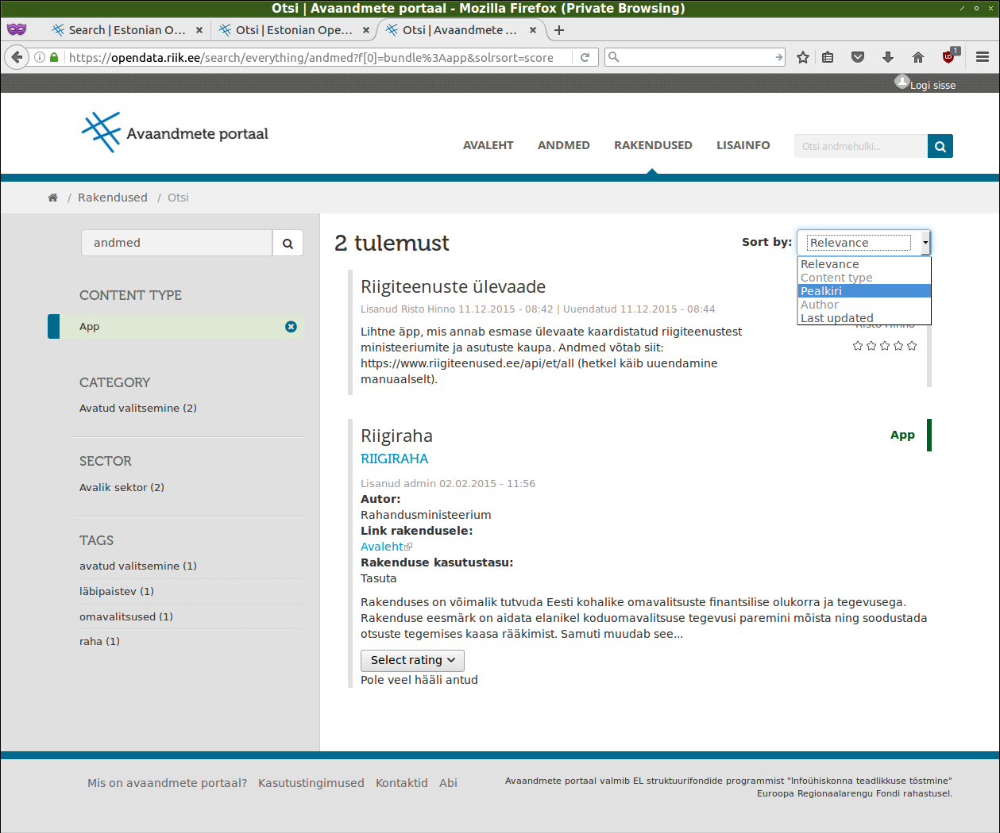

# Avaandmete portaali https://opendata.riik.ee mitmekeelne kasutajaliides

Avaandmete portaal põhineb Briti Ühendkuningriigi valitsuse poolt arendatud [Data.gov.uk portaali](https://github.com/datagovuk/dgu-vagrant-puppet) tarkvaral, mis omakorda põhineb [CKAN avaandmete halduse tarkvaral](http://ckan.org/) ja [Drupali sisuhaldustarkvaral](https://www.drupal.org/). Eesti avaandmete portaali mitmekeelne kasutajaliides on realiseeritud kasutades võimalust mööda sellele aluseks oleva [avatud lähtekoodiga tarkvara](https://www.mkm.ee/sites/default/files/tarkvara_raamistik.pdf) tõlkemooduleid ja nendele moodulitele aluseks olevaid tarkavaratõlke standardeid.

Kõigi alustarkvara ja selle moodulite tõlkesüsteemid põhinevad vaba tarkvara vallas _de facto_ standardi staatust omava [GNU _Gettext_](https://www.gnu.org/software/gettext/manual/html_node/Introduction.html) vahenditel. Nende kasutamist on jätkatud ning tõlgete haldus põhineb GNU _Gettext_ ökosüsteemis [sissetöötatud praktikatel](https://viki.pingviin.org/Tarkvara_t%C3%B5lkimine_(juhend)).

## CKAN

Kuigi portaali tuum põhineb CKANi avaandmete halduse tarkvaral, siiski ei kasuta ei ühendkuningriigi (edaspidi DGUK) ega meie avaandmete portaal märkimisväärselt selle tõlkesüsteemi, sest suurem jagu kasutajaliidesest on realiseeritud CKAN funktsionaalsuse ülekatetena _ckanext_-laiendmoodulite kujul ja Drupali sisuhalduses. Siiski genereeritakse ja hallatakse CKANi põhineva portaaliosa tõlkefaile [koodipuu CKANi harus](https://github.com/opendata-ee/ckan).

### Kasutajaliidese tõlked

Tõlkimist vajavad kasutajaliidese fraasid on üldiselt süsteemi loogikat realiseerivas Pythoni lähtekoodis, Genshi HTML-mallides ja kasutajaliidese komponente täiendavas JavaScripti lähtekoodis. CKANi on sisse ehitatud kõigi nende tõlkimiseks vajalikud vahendid, kuid DGUK portaalis tõlget realiseeritud pole, mistõttu on tõlkemoodulite töökord osaline, sj CKANi ametlikke JavaScripti funktsioone, sh [Jed-tõlkemooduleid](http://docs.ckan.org/en/ckan-2.2.3/frontend-development.html#i18n-jed) ülepea ei kasutata.

Avaandmete portaali CKANil põhineva kasutajaliidese tõlgitavad fraasid on:

* [Pythoni lähtekoodis](http://docs.ckan.org/en/latest/contributing/string-i18n.html#internationalizing-strings-in-python-code), mis on kasutusel läbivalt CKANis, kõigis selle moodulites ning HTML-mallides.
* [Genshi mallides](https://pythonhosted.org/Genshi/i18n.html), mis asuvad peamiselt [ckanext-dgu mallide kataloogides](https://github.com/opendata-ee/ckanext-dgu/tree/look_feel_est/ckanext/dgu/theme/templates), aga ka muude kasutusel olevate _ckanext_-moodulite alamkataloogides.
* [JavaScripti lähtekoodis](https://github.com/infoaed/shared_dguk_assets/commits/look_feel_est/src/js/odp-ee-i18n.js), mille tõlkimiseks on võetud minimalismi põhimõttest lähtuvalt võetud kasutusele [Simple i18n for JavaScript Apps](https://github.com/roddeh/i18njs).

Täpsemad juhised tõlgete haldamiseks leiab [paigaldusjuhisest](../INSTALL.md#skripti--laadi--ja-keeleseadistuste-genereerimine).

> Kuna avaandmete portaalis on kasutusel DGUK tarkvara versioon 2014. aastast, mis põhineb [CKANi 2.2 seerial](https://docs.ckan.org/en/release-v2.2.3/), siis on nüüdseks on DGUK võtnud [CKANi eeskujul](http://docs.ckan.org/en/latest/contributing/frontend/templating.html) HTMLi mallide jaoks kasutusele Jinja2 raamistiku. See tähendab, et DGUK ja CKAN tarkvara uute versioonide kasutuselevõtmisel tuleb ka tõlkesüsteem uuele standardile üle kanda.
> 
> Avaandmete portaali loomise ajal kasutas CKAN juba Jinja2 raamistikku, DGUK kasutas veel Genshi raamstikku, aga oli Jinja2 raamistikule üle minemas. 2017. aasta alguses hindavad DGUK arendajad oma portaali kasutajaliidest vananenuks ning pakuvad, et see uuendatakse poole aasta jooksul (info kirjavahetusest portaali arendajaga).

### Andmestiku mitmekeelsus

CKAN võimaldab lisamoodulite abil hallata ka [mitmekeelset andmesisu](http://docs.ckan.org/en/latest/maintaining/multilingual.html), kuid kasutajaliidese tõlkimiseks osutus vajalikuks ainult märksõnastiku tõlgete moodul, mille abil realiseeritakse Eurovoc sõnastiku automaattõlge inglise keelte.

Täpsema kirjelduse märksõnastiku tõlgete halduse kohta leiab [paigaldusjuhisest](../INSTALL.md#ckani-eurovoc-märksõnastiku-ja-tõlgete-importimine).

### Otsingusüsteemi mitmekeelsus

DGUK portaalis on seadistatud andmehulkade otsing inglise keele baasil, CKAN võimaldab seadistada mitmekeelset ja/või eri keelte eripärasid arvestavat indekseerimist (nt sõnade algvormide eraldamine, liitsõnade osadeks jagamine jmt). Kasutajaliidese mitmekeelsuse jaoks on otsing seadisistatud leidma märksõnu sõltumata valitud keelest.

## Drupal

DGUK portaalis on võimalik kasutada Drupali sisuhaldusse sisseehitatud tõlkemooduleid, millele lisaks on avaandmete portaalis kasutusel hulk Drupali arendusmeeskonna poolt soovitatavaid [täiendavaid tõlkemooduleid](https://www.drupal.org/project/i18n).

Drupali tõlgitavad fraasid on laiali selle [lähtekoodis](http://cgit.drupalcode.org/drupal/tree/?h=7.x) (see on portaali paigalduse raames alla laaditud serveri kataloogi `/var/www/drupal/dgu`), laiendmoodulites (need on paigalduse raames alla laaditud serveri kataloogi `/var/www/drupal/dgu/profiles/dgu/modules/contrib`) ja DGUK täiendavates [_Features_-moodulites](https://github.com/opendata-ee/dgu_d7/tree/look_feel_est/modules/features) ja muudes kohandatud moodulites kataloogides [modules/custom](https://github.com/opendata-ee/dgu_d7/tree/look_feel_est/modules/custom) ja `/var/www/drupal/dgu/sites/all/modules`.

Tõlkimisel kasutatakse _Gettext_ PO-failide importimist/eksportimist, Drupali vastavat liidest ning protsessi hõlbustavaid lisamooduleid. JavaScripti tõlkimisel kasutatakse CKANiga sama minimalistlikku lisamoodulit, mida hallatakse mõlema koodibaasi üleselt.

Drupali tõlkimise täpsem kirjeldus on [paigaldusjuhises](../INSTALL.md#tõlgete-lisamine).

### Otsingusüsteemi mitmekeelsus

DGUK portaali Drupali osa rakenduste ja foorumiteemade otsing oli seadistatud inglise keele baasil. Kuna mitmekeelse otsingu ega saidi mitmekeelse sisu, sj märksõnade indekseerimise võimalusi pole loodud, siis on kasutajaliidese tõlkeprojekti raames seadistatud [elementaarne keelest sõltumatu otsing DGUK vaikimisi seadistustega](../INSTALL.md#dgu-search).

## Jagatud tõlked

DGUK portaali loogikas jagavad CKAN ja Drupal kujundusi, nendega seotud laadifaile ja kasutajaliides skripte [shared_dguk_assets](https://github.com/opendata-ee/shared_dguk_assets) harus. Kuna ka tõlgitavat _JavaScript_'i jagatakse nende kahe platvormi vahel, siis on selle tõlkimine realiseeritud samuti mõlemale ühiselt ja kasutab vastavaks otstarbeks kohandatud _Gettext_-lahendust.

Täpsemalt kirjeldab jagatud _JavaScript_'i tõlgete haldamist [paigaldusjuhis](../INSTALL.md#skripti--laadi--ja-keeleseadistuste-genereerimine).

## Tehtud tööd

Algses avaandmete portaalis tõlkemooduleid [hoolimata nende olemasolust sisuliselt ei kasutatud](https://github.com/datagovuk/ckanext-dgu/issues/46), eri komponentides esinevad kasutajaliidese fraasid olid vastavalt vajadusele täidetud eestikeelse sisuga. [_Hardcoding_](https://en.wikipedia.org/wiki/Hard_coding#Overview)-võtetega tõlgitud kasutajaliidese puhul ei ole tõlked hallatavad, mh muudab tõlgitavate fraaside ning programmkoodi läbisegi esinemine kaelamurdvaks ka baastarkvara ja selle uuenduste haldamise ka juhul, kui portaal on kasutusel ühekeelsena.

> Siiski pole see DGUK portaali Eesti kohanduse eripära, samasuguse _ad hoc_ lahenduse teed on läinud ka [Horvaatia avaandmete portaal](https://github.com/datagovhr/data.gov.hr) ja [Sloveenia avaandmete portaal](https://gitlab.xlab.si/MJU-POPS/ckanext-dgu). Teadaolevatest kohandustest pole ükski peale Eesti avaandmete portaali praegu korrektset tõlkemehhanismi seadistanud, nt [Iirimaa avandmete portaal](https://data.gov.ie/about) saab ootuspäraselt läbi tõlgeteta. Rohkematest käigus olevatest DGUK kohandustest selle arendajad 2017. aasta alguses teadlikud polnud ning pakkusid, et DGUK portaali aluseks võtmine võib olla mitte niivõrd tehniliselt läbikaalutud, vaid paljuski poliitiline otsus, võimalik et inspireeritud Briti Ühendkuningriigi Euroopa avaandmete lipulaeva rollist. Sloveenia portaali puhul oli otsus tõlkesüsteemist mööda minna seotud arendustööde tähtajaga (info kirjavahetusest portaali arendajaga).

Mitmekeelsuse tagamiseks oli tehti järgnevat:

* Lähtekoodi tekstis tuvastati _ad hoc_ eesti tõlked ja eraldati need programmkoodist (vt seotud muudatused [`look_feel_est` võrdluspäringutes](../README.md#replace-hardcoded-estonian-with-gettexted-english)).
* Eestikeelsed tekstiõigud ja fraasid [tõlgiti inglise keelde ja toimetati](https://github.com/infoaed/opendata-portal/tree/master/translations).
* Portaali eri tarkvarakomponentiode jaoks valiti ja seadistati tõlkemoodulid, loodi mitmekeelsuse jaoks vajalikud kasutajaliidese komponendid (vt seotud muudatused [`i18n_logic` harus](https://github.com/infoaed/opendata-portal#language-switcher-gettext-generation-and-other-i18n-logic)).
* Eesti fraasid asendati lähtekoodis ingliskeelse tõlkega ja märgendati _Gettext_-vahendite abil tõlgitavaks, eesti vasted talletati ning teisendati _Gettext_-vormingusse taaskasutamiseks tõlkemoodulite abil.
* Seadistati tõlgitavaks portaali olemasolev sisu ja tõlgiti, kui võimalik, nt Eurovoc-märksõnastik ja klassifikaatorid.
* Kanti _Features_-moodulitesse üle Drupali portaali 2014. aastast alates laiv-keskkonnas tehtud muudatused ja veenduti, et tõlked on realiseeritud sisuhalduse lähtekoodis ning ülekantavad test- ja toodanguportaali vahel (vt muudatusi [`odp_ee_features` harus](https://github.com/infoaed/opendata-portal#merge-live-portal-changes-since-2014-into-drupal-features)).
* Muudatused viidi sisse ja dokumenteeriti [GitHubi arenduskeskkonna avalikes koodivaramutes](https://github.com/infoaed/opendata-portal) avatud lähtekoodiga tarkvaraarenduse põhimõtetest lähtuvalt.

## Hinnang portaali tarakvara seisundile

